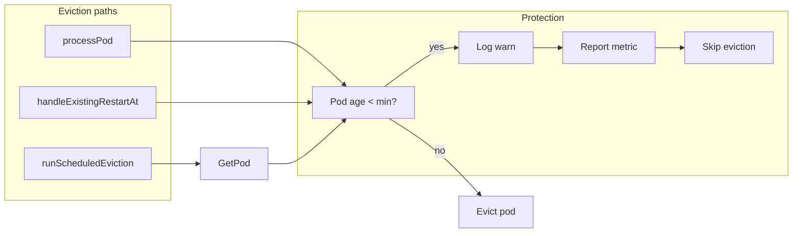

# Too-frequent restart protection and alert metric

## Goal

- **Detect**: Pod would be evicted (memory-threshold or scheduled) but pod age < configured minimum (default 30 min).
- **Action**: Log warn, **skip eviction** (protection), and increment a Prometheus counter so alerts can fire.
- **Config**: Min pod age configurable via ENV (e.g. `PREOOMKILLER_MIN_POD_AGE_BEFORE_EVICTION_SEC`, default 1800s = 30m).

## Architecture



## 1. Config

**File:** [internal/config/config.go](internal/config/config.go)

- Add `MinPodAgeBeforeEviction time.Duration` to `Config`.
- Read from ENV, e.g. `PREOOMKILLER_MIN_POD_AGE_BEFORE_EVICTION_SEC`; default `1800` (seconds = 30m). Parse as integer seconds; support only non-negative values (0 = disabled).
- Add `MetricsPort string` (default `9090`), from ENV `PREOOMKILLER_METRICS_PORT`.

## 2. Logic layer (controller)

**Files:** [internal/logic/controller/interfaces.go](internal/logic/controller/interfaces.go), [internal/logic/controller/service.go](internal/logic/controller/service.go). No new interfaces for reporting.

- **Repository**: Add `GetPodQuery(ctx context.Context, namespace, name string) (Pod, error)` to [internal/logic/controller/interfaces.go](internal/logic/controller/interfaces.go). Return domain `Pod` (with `CreatedAt`); use existing not-found error pattern from k8s adapter (e.g. `errPodNotFound`).
- **Service**:
  - Add field: `minPodAgeBeforeEviction time.Duration` only.
  - **Centralize age check inside `evictPodCommand`** so all eviction paths (processPod, handleExistingRestartAt, runScheduledEviction) share one implementation and avoid duplication. Signature: `evictPodCommand(ctx, logger, namespace, name string, pod *Pod) (bool, error)`. When `pod == nil` (e.g. from runScheduledEviction), call `GetPodQuery` to fetch the pod; on non-not-found error log and skip eviction. Then: if `minPodAgeBeforeEviction > 0 && time.Since(pod.CreatedAt) < minPodAgeBeforeEviction`: log warn (lowercase, structured fields), call `metrics.RecordEvictionSkippedPodTooYoung`, return `(false, nil)`. Otherwise call `repo.EvictPodCommand`.
  - Call sites: **processPod** and **handleExistingRestartAt** pass `&pod`; **runScheduledEviction** passes `nil` (evictPodCommand fetches via GetPodQuery).
- **Constructor** `New(...)`: Add parameter `minPodAgeBeforeEviction time.Duration` only. No reporter dependency.

## 3. K8s adapter: GetPodQuery

**Files:** [internal/adapters/outbound/k8s/adapter.go](internal/adapters/outbound/k8s/adapter.go), [internal/adapters/outbound/k8s/errors.go](internal/adapters/outbound/k8s/errors.go) (if exists; else in adapter or errors file).

- Implement `GetPodQuery(ctx, namespace, name string) (controller.Pod, error)` using `a.clientset.CoreV1().Pods(namespace).Get(ctx, name, metav1.GetOptions{})`, map with existing `toDomainPod`, return `errPodNotFound` on `apierrors.IsNotFound(err)`.

## 4. Metrics (Prometheus) — global registry, counter

**Best practice (Prometheus docs):** Use the **default registry** for simple apps: register metrics with `prometheus.DefaultRegisterer` (or `promauto`, which uses it). Expose `/metrics` with `promhttp.Handler()`, which uses `prometheus.DefaultGatherer` and will include all metrics registered on the default registry. Counters are the right type for "number of times X happened" (only increase; use `_total` suffix).

- **Dependency**: Add `github.com/prometheus/client_golang/prometheus` and `.../prometheus/promauto`, `.../prometheus/promhttp`.
- **New package** `internal/infra/metrics`:
  - **Global metric registry**: Use the **default registry**. Create the counter with `promauto.With(prometheus.DefaultRegisterer).NewCounterVec(prometheus.CounterOpts{ Name: "preoomkiller_eviction_skipped_pod_too_young_total", Help: "Total number of evictions skipped because pod age was below minimum (possible misconfiguration or too-frequent restarts)." }, []string{"namespace", "pod"})`. Store in a package-level variable (unexported).
  - Expose a single function: `func RecordEvictionSkippedPodTooYoung(namespace, pod string)` that does `counter.WithLabelValues(namespace, pod).Inc()`. Controller calls this in-place where it skips eviction (no separate reporter type).
- **Metrics server (separate port):** Expose metrics on a **dedicated port** (default `9090`) so Prometheus can scrape without hitting the main health/status server. New component `MetricsServer` in [internal/httpserver/metrics_server.go](internal/httpserver/metrics_server.go): listens on `PREOOMKILLER_METRICS_PORT`, serves only `GET /metrics` via `promhttp.Handler()`. Register with appstate (shutdown + pinger). Config: `MetricsPort string` (e.g. from `PREOOMKILLER_METRICS_PORT`, default `9090`).

## 5. Wiring (app)

**File:** [internal/app/app.go](internal/app/app.go)

- Load `cfg.MinPodAgeBeforeEviction` and `cfg.MetricsPort` from config.
- Create controller with new arg: `minPodAgeBeforeEviction` only. No reporter; controller calls `metrics.RecordEvictionSkippedPodTooYoung` from inside `evictPodCommand` when it skips.
- Start metrics server on `cfg.MetricsPort` (default 9090), register shutdowner and pinger. Include metrics server in ready wait (allChannelsClose).

## 6. PromQL examples (documentation / README)

- **Alert when at least one skip happened in the last 5 minutes:**
  ```promql
  increase(preoomkiller_eviction_skipped_pod_too_young_total[5m]) > 0
  ```
- **Alert when rate of such skips is non-zero (e.g. over 1h window):**
  ```promql
  rate(preoomkiller_eviction_skipped_pod_too_young_total[1h]) > 0
  ```
- **Count by namespace for dashboards:**
  ```promql
  sum by (namespace) (increase(preoomkiller_eviction_skipped_pod_too_young_total[24h]))
  ```

Add a short "Alerting" or "Metrics" subsection in [README.md](README.md) documenting the metric name, labels, meaning, and the above PromQL examples.

## 7. Tests and mocks

- **Controller**: Unit tests for the new behavior in `processPod` (pod too young: no eviction, warn path; mock repo). For `handleExistingRestartAt`, test age check when pod is too young (no eviction). For `runScheduledEviction`, test with mocked `GetPodQuery` returning a young pod: assert no eviction. Metrics are called in-place; tests can either assert the counter was incremented (e.g. by using a test registry and checking metric values) or only assert eviction was skipped and log.
- **K8s adapter**: Unit test for `GetPodQuery` (success, not-found). Keep conversions covered by existing patterns.
- **Metrics**: Optional: test that `RecordEvictionSkippedPodTooYoung` increments the counter (e.g. register with a local registry in test and gather to assert).
- Regenerate mocks after interface changes: `just generate` (mockery for `Repository` only).

## 8. Counter (not gauge)

Use a **counter** for "skipped too often eviction": it only increases, which is correct for "number of times we skipped due to pod too young". Prometheus counters use the `_total` suffix by convention. Alerts use `increase(...)` or `rate(...)` over a time window.

## 9. Edge cases

- **Min pod age 0**: Treat 0 as "disabled" (never skip eviction due to age). So condition is `minPodAgeBeforeEviction > 0 && podAge < minPodAgeBeforeEviction`.
- **GetPodQuery in runScheduledEviction**: If GetPod fails for reasons other than not-found, log error and skip eviction (safe default) or retry; document behavior. Prefer: on error other than not-found, log and skip eviction (do not evict without age check when we intended to check).

## File change summary

| Area        | Files                                                                 |
| ----------- | --------------------------------------------------------------------- |
| Config      | `internal/config/config.go` (+ test)                                 |
| Logic       | `internal/logic/controller/interfaces.go`, `service.go`              |
| K8s adapter | `internal/adapters/outbound/k8s/adapter.go`                           |
| Metrics     | New package `internal/infra/metrics` + `internal/httpserver/metrics_server.go` |
| App         | `internal/app/app.go`                                                 |
| Docs        | `README.md` (metric + PromQL + alert examples)                         |

## PromQL reference (for README)

```promql
# Fire alert if any eviction was skipped due to pod too young in last 5m
increase(preoomkiller_eviction_skipped_pod_too_young_total[5m]) > 0

# Optional: by namespace
sum by (namespace) (increase(preoomkiller_eviction_skipped_pod_too_young_total[5m])) > 0
```
